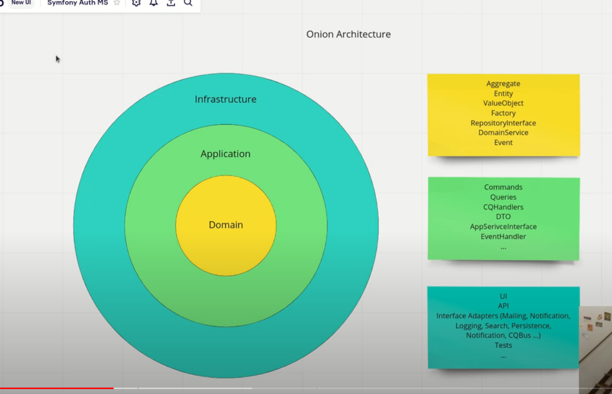
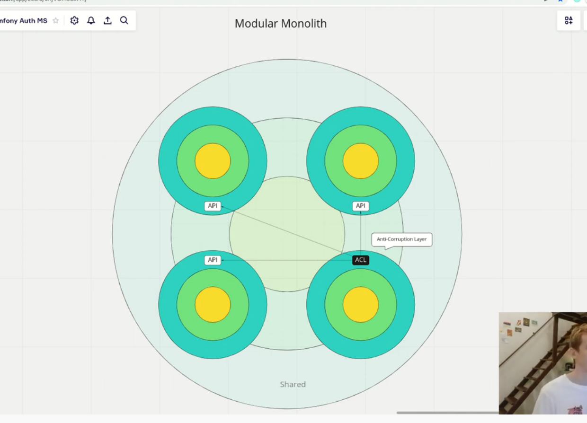

## Шаблон для простых проектов

### Docker = PHP + Nginx

>https://docs.docker.com/engine/install/

>https://docs.docker.com/compose/install/

>https://symfony.com/doc/current/setup.html

```bash
composer create-project symfony/skeleton:"6.1.*" app
cp -rp /var/www/app/* /var/www/
```

>INSTALL_XDEBUG=true

>
1. определение контекста предметной области
2. подход - MonolithFirst
https://martinfowler.com/bliki/MonolithFirst.html
*устоявшиеся модули переносятся в микросервисы

3. каждый контекст - отдельный модуль<br>
 интерфейс модуля слой - поставщик<br>
модуль клиент слой (anti-corruption слой) - адаптера (слой обмена)<br>
последний слой - ядро : <br>
- общие интерфейсы <br>
- зависимости<br>
- файлы конфигурации<br>


+ слеплено по подкасту : 
+ https://www.youtube.com/watch?v=Yl7uVEMBLgA